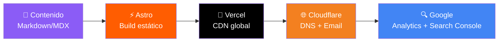
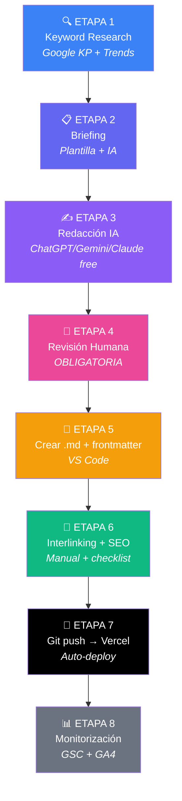

# 🚀 Plan Estratégico: StackedTools.online — Stack 100% GRATUITO

---

## 💰 Filosofía de Costes: $0/mes

> [!IMPORTANT]
> **Regla de oro del proyecto:** Todo gratis, excepto el dominio. Si alguna herramienta requiere pago, se busca alternativa free o se descarta.

### Desglose de Costes

| Componente | Herramienta | Coste |
|:---|:---|:---:|
| **Dominio** | `stackedtools.online` | ~$3-10/año ⚡ ÚNICO GASTO |
| Hosting + CDN + SSL | Vercel (Hobby plan) | **$0** |
| Framework / CMS | Astro (open source) | **$0** |
| Control de versiones | GitHub (free) | **$0** |
| Analytics | Google Analytics 4 | **$0** |
| Search Console | Google Search Console | **$0** |
| SEO metadata | astro-seo (npm package) | **$0** |
| Sitemap | @astrojs/sitemap | **$0** |
| Imágenes | Astro Image (built-in WebP/AVIF) | **$0** |
| Formulario contacto | Formspree (free: 50 envíos/mes) | **$0** |
| Email profesional | Cloudflare Email Routing → Gmail | **$0** |
| Keyword Research | Google Keyword Planner + Trends | **$0** |
| Diseño / Mockups | Figma (free tier) | **$0** |
| Iconos | Lucide Icons (open source) | **$0** |
| Tipografía | Google Fonts (Inter) | **$0** |
| Redacción IA | Prompts manuales (ChatGPT free / Gemini free) | **$0** |
| DNS | Cloudflare (free plan) | **$0** |
| **TOTAL MENSUAL** | | **$0/mes** |
| **TOTAL ANUAL** | | **~$3-10/año** |

---

## Decisión de Dominio: `stackedtools.online`

| Criterio | `.online` | `.site` | `.space` |
|:---|:---:|:---:|:---:|
| **Percepción profesional** | ✅ Alta — transmite "digital-first" | ⚠️ Media | ⚠️ Baja |
| **Confianza del usuario** | ✅ La más reconocida de las tres | Neutral | Neutral-baja |
| **Brandability** | ✅ Suena como plataforma SaaS | Aceptable | Forzado |
| **Memorabilidad** | ✅ Fácil de recordar y dictar | Neutral | Neutral |

> **Veredicto: `stackedtools.online`** — Refuerza la identidad de portal digital activo y accesible.

---

## FASE 1: Naming, Nicho y Arquitectura de Marca

### 1.1 Nicho: Herramientas SaaS, IA y Productividad Digital

| Sub-nicho | CPC estimado (US) | Volumen búsquedas | Automatizable |
|:---|:---:|:---:|:---:|
| **Reviews de herramientas IA** | $2.50 – $6.00 | 🔥 Altísimo | ✅ Muy alto |
| **Software de productividad SaaS** | $3.00 – $8.00 | 🔥 Alto | ✅ Alto |
| **Guías de automatización / workflows** | $2.00 – $5.00 | 📈 Creciente | ✅ Alto |
| **Alternativas de software ("X vs Y")** | $4.00 – $10.00 | 📈 Alto (intent comercial) | ✅ Muy alto |

> [!TIP]
> Priorizar keywords de **intención de compra** ("best CRM for small business", "Notion vs Obsidian", "ChatGPT alternatives 2026") = CPC más alto.

### 1.2 Identidad Visual y Línea Editorial

#### 🎨 Identidad Visual

| Elemento | Especificación |
|:---|:---|
| **Paleta primaria** | Negro `#0A0A0B` + Blanco `#FAFAFA` + Azul eléctrico `#3B82F6` |
| **Acento** | Violeta IA `#8B5CF6` + Verde éxito `#10B981` |
| **Tipografía** | **Inter** (Google Fonts — gratis) |
| **Estilo visual** | Minimalista tech, glassmorphism sutil. Inspiración: Verge, Product Hunt |
| **Iconografía** | Lucide Icons (open source, gratis) |
| **Imágenes** | Screenshots reales de herramientas. Cero stock genérico |

#### ✍️ Línea Editorial

| Aspecto | Definición |
|:---|:---|
| **Tono de voz** | Cercano pero experto. Como un colega técnico que te lo explica claro. Opinión directa. |
| **Público objetivo** | Profesionales digitales (25-45), freelancers, startups, PYMEs. Tráfico: US, UK, CA, AU, ES, LATAM. |
| **Propuesta de valor** | *"Descubre, compara y domina las mejores herramientas digitales. Análisis profundos, sin relleno, sin hype."* |
| **Diferenciador** | Tablas comparativas con datos reales + veredictos claros + recomendación directa |

#### 👤 Perfiles de Autor (E-E-A-T)

| Campo | Valor |
|:---|:---|
| **Firma editorial** | "El equipo de StackedTools" (artículos generales) |
| **Autores individuales** | 2-3 perfiles con nombre, foto profesional y bio |
| **Formato** | Autor + fecha publicación + fecha última actualización en cada artículo |

---

## FASE 2: Arquitectura Web y Stack Técnico (100% GRATIS)

### 2.1 ¿Por qué Astro + Vercel en vez de WordPress?

| Criterio | WordPress (self-hosted) | Astro + Vercel |
|:---|:---:|:---:|
| **Coste hosting** | $5-15/mes | **$0** (Vercel Hobby) |
| **Velocidad (Core Web Vitals)** | ⚠️ Requiere optimización | ✅ 100/100 por defecto |
| **Seguridad** | ⚠️ Vulnerable (plugins, updates) | ✅ Estático = imbatible |
| **SEO técnico** | Bueno con plugins | ✅ Excelente nativo |
| **Mantenimiento** | Alto (updates, backups) | **Cero** — deploy automático |
| **AdSense compatible** | ✅ Sí | ✅ Sí (HTML estándar) |
| **Escalabilidad** | Limitada por servidor | ✅ CDN global automático |
| **Coste total** | ~$100-200/año mínimo | **~$3-10/año** (solo dominio) |

> [!IMPORTANT]
> Astro genera HTML puro (zero JavaScript by default), lo que significa **Core Web Vitals perfectos**, carga ultra-rápida y mejor posicionamiento SEO. Google favorece sitios rápidos.

### 2.2 Stack Tecnológico Completo (Todo Gratis)



#### Framework y Deploy

| Componente | Herramienta | Coste | Límites Free |
|:---|:---|:---:|:---|
| **Framework** | Astro 5.x | $0 | Sin límites (open source) |
| **Hosting** | Vercel Hobby | $0 | 100GB bandwidth/mes, 6000 min build/mes |
| **Repositorio** | GitHub | $0 | Repos ilimitados |
| **DNS** | Cloudflare | $0 | DNS ilimitados, protección DDoS básica |
| **SSL** | Vercel (automático) | $0 | Incluido |
| **CI/CD** | Vercel (auto-deploy on push) | $0 | Deploy automático en cada commit |

#### SEO y Analytics (Gratis)

| Función | Herramienta | Coste |
|:---|:---|:---:|
| **Meta tags / OG** | `astro-seo` npm package | $0 |
| **Sitemap XML** | `@astrojs/sitemap` | $0 |
| **RSS Feed** | `@astrojs/rss` | $0 |
| **Schema JSON-LD** | Componente custom Astro | $0 |
| **Analytics** | Google Analytics 4 (GA4) | $0 |
| **Search performance** | Google Search Console | $0 |
| **Core Web Vitals** | PageSpeed Insights | $0 |

#### Keyword Research (Gratis)

| Herramienta | Función | Coste |
|:---|:---|:---:|
| **Google Keyword Planner** | Volumen, CPC, competencia | $0 (con cuenta Google Ads) |
| **Google Trends** | Tendencias y estacionalidad | $0 |
| **AnswerThePublic** | Preguntas de usuarios (limitado) | $0 (3 búsquedas/día) |
| **AlsoAsked.com** | PAA (People Also Ask) clusters | $0 (limitado) |
| **Ubersuggest** | Keywords + KD (limitado) | $0 (3 búsquedas/día) |
| **Google Search (PAA/related)** | Búsquedas relacionadas manuales | $0 |

#### Contenido y Diseño (Gratis)

| Función | Herramienta | Coste |
|:---|:---|:---:|
| **Redacción IA** | ChatGPT free / Gemini free / Claude free | $0 |
| **Tipografía** | Google Fonts (Inter) | $0 |
| **Iconos** | Lucide Icons / Phosphor Icons | $0 |
| **Diseño UI** | Figma (free tier) | $0 |
| **Compresión imágenes** | Astro `<Image />` (WebP/AVIF auto) | $0 |
| **Screenshots** | ShareX (open source, Windows) | $0 |

#### Comunicación y Legal (Gratis)

| Función | Herramienta | Coste |
|:---|:---|:---:|
| **Email profesional** | Cloudflare Email Routing → Gmail | $0 |
| **Formulario contacto** | Formspree (50 envíos/mes) o Formspark | $0 |
| **Cookies banner** | Osano free o custom script | $0 |
| **Privacy Policy** | Plantilla personalizada (incluida en plan) | $0 |

### 2.3 Estructura de Categorías (Silos SEO)

```
stackedtools.online/
│
├── /ai-tools/              → Herramientas de Inteligencia Artificial
│   ├── /ai-tools/chatbots/
│   ├── /ai-tools/image-generators/
│   └── /ai-tools/coding-assistants/
│
├── /productivity/          → Productividad y Gestión
│   ├── /productivity/project-management/
│   ├── /productivity/note-taking/
│   └── /productivity/time-tracking/
│
├── /comparisons/           → Comparativas y Alternativas
│   ├── /comparisons/vs/
│   └── /comparisons/alternatives/
│
├── /automation/            → Automatización y Workflows
│   ├── /automation/no-code/
│   ├── /automation/integrations/
│   └── /automation/guides/
│
├── /business-software/     → Software Empresarial
│   ├── /business-software/crm/
│   ├── /business-software/marketing/
│   └── /business-software/analytics/
│
└── /guides/                → Guías Prácticas y Tutoriales
    ├── /guides/getting-started/
    ├── /guides/workflows/
    └── /guides/best-practices/
```

### 2.4 Páginas Estáticas Obligatorias

| Página | URL | Propósito |
|:---|:---|:---|
| **Inicio** | `/` | Hero + últimos artículos + categorías |
| **Sobre Nosotros** | `/about/` | Misión, equipo editorial con fotos y bios |
| **Contacto** | `/contact/` | Formulario Formspree + email |
| **Política de Privacidad** | `/privacy-policy/` | RGPD + CCPA (obligatorio AdSense) |
| **Términos y Condiciones** | `/terms/` | Condiciones de uso |
| **Disclaimer** | `/disclaimer/` | Disclosure afiliados y editorial |
| **Política de Cookies** | `/cookie-policy/` | Con banner de consentimiento |

### 2.5 Estructura del Proyecto Astro

```
stackedtools/
├── public/
│   ├── ads.txt                  ← AdSense (cuando se apruebe)
│   ├── robots.txt
│   ├── favicon.svg
│   └── images/
│       └── authors/             ← Fotos de autores
│
├── src/
│   ├── components/
│   │   ├── Header.astro
│   │   ├── Footer.astro
│   │   ├── ArticleCard.astro
│   │   ├── TableOfContents.astro
│   │   ├── ComparisonTable.astro
│   │   ├── AdUnit.astro         ← Componente reutilizable para AdSense
│   │   ├── AuthorBio.astro
│   │   ├── SEOHead.astro
│   │   ├── CookieBanner.astro
│   │   └── Newsletter.astro
│   │
│   ├── layouts/
│   │   ├── BaseLayout.astro     ← Layout base (head, nav, footer)
│   │   ├── ArticleLayout.astro  ← Layout para artículos (con sidebar ads)
│   │   └── PageLayout.astro     ← Layout para páginas estáticas
│   │
│   ├── pages/
│   │   ├── index.astro          ← Homepage
│   │   ├── about.astro
│   │   ├── contact.astro
│   │   ├── privacy-policy.astro
│   │   ├── terms.astro
│   │   ├── disclaimer.astro
│   │   ├── cookie-policy.astro
│   │   └── [...slug].astro      ← Dynamic routing para artículos
│   │
│   ├── content/
│   │   ├── config.ts            ← Content Collections schema (Zod)
│   │   ├── ai-tools/
│   │   │   ├── best-ai-chatbots-2026.md
│   │   │   └── ...
│   │   ├── productivity/
│   │   ├── comparisons/
│   │   ├── automation/
│   │   ├── business-software/
│   │   └── guides/
│   │
│   ├── styles/
│   │   └── global.css           ← Design system completo
│   │
│   └── utils/
│       ├── seo.ts               ← Helpers para meta tags y schema
│       └── dates.ts             ← Formateo de fechas
│
├── astro.config.mjs
├── package.json
├── tsconfig.json
└── README.md
```

> [!NOTE]
> **Flujo de publicación:** Escribir artículo en Markdown → Commit a GitHub → Vercel detecta el push → Build automático → Sitio actualizado en ~30 segundos. **Cero intervención manual en el deploy.**

---

## FASE 3: Flujo de Trabajo y Automatización con IA

### 3.1 Pipeline de Producción (Adaptado a Stack Gratuito)



### Desglose de cada Etapa

#### ETAPA 1: Keyword Research (Semanal)
- **Herramientas gratuitas:** Google Keyword Planner + Google Trends + AnswerThePublic
- **Proceso:**
  1. Generar cluster de 15-20 keywords por categoría/mes
  2. Filtrar: Volumen > 500/mes, dificultad manejable, CPC > $1.50
  3. Clasificar por intención: informacional, comparativa, transaccional
  4. Priorizar comparativas y transaccionales (mayor CPC)
- **Output:** Spreadsheet (Google Sheets — gratis) con keyword, volumen, CPC, intención, categoría

#### ETAPA 2: Generación de Briefings
- **Herramienta:** Plantilla de briefing (incluida abajo) + IA free
- **Proceso:**
  1. Keyword principal + 3-5 secundarias
  2. Revisar top 5 SERP → identificar gaps
  3. Definir estructura H2/H3
  4. Especificar tablas, datos, CTAs, enlaces internos
- **Output:** Briefing listo para el prompt maestro

#### ETAPA 3: Redacción con IA (Modelos Gratuitos)

| Modelo | Tier Gratuito | Mejor para |
|:---|:---|:---|
| **ChatGPT (GPT-4o mini)** | Mensajes limitados/día | Artículos largos, comparativas |
| **Google Gemini** | Generoso en free tier | Research, datos actualizados |
| **Claude (Sonnet)** | Mensajes limitados/día | Tono natural, edición |
| **Rotación** | Alternar modelos | Evitar patrones detectables |

> [!TIP]
> **Truco clave:** Alternar entre modelos IA para cada artículo produce variación estilística natural. Google detecta patrones repetitivos de un solo modelo.

#### ETAPA 4: Revisión Humana (OBLIGATORIA — NO OMITIR)

> [!CAUTION]
> **Publicar sin revisión humana = rechazo de AdSense + penalización de Google.** Esta etapa NO es opcional.

**Checklist de revisión:**
- [ ] ¿Datos y cifras verificables y actualizados?
- [ ] ¿Se reemplazaron afirmaciones genéricas por datos específicos?
- [ ] ¿Tono natural, no robótico?
- [ ] ¿Tablas comparativas con info real y precisa?
- [ ] ¿Precios actualizados o "al momento de publicación"?
- [ ] ¿Hay opinión editorial propia?
- [ ] ¿Pasa el test: "¿publicaría un editor humano esto con orgullo?"

#### ETAPA 5: Crear archivo Markdown + Frontmatter
- Crear archivo `.md` en la carpeta de categoría correspondiente
- Añadir frontmatter con schema (ver estructura del proyecto)
- Insertar screenshots reales de las herramientas
- Verificar formato y tablas

**Ejemplo de frontmatter:**
```yaml
---
title: "Best AI Chatbots in 2026: Complete Comparison"
description: "Compare the top AI chatbots including ChatGPT, Claude, and Gemini. Features, pricing, and honest verdict."
author: "alex-rivera"
category: "ai-tools"
tags: ["ai", "chatbots", "comparison"]
publishDate: 2026-07-28
updatedDate: 2026-07-28
image: "./images/ai-chatbots-cover.webp"
imageAlt: "Comparison of AI chatbot interfaces"
featured: true
draft: false
---
```

#### ETAPA 6: Interlinking + SEO On-Page
- Añadir 3-5 enlaces internos a artículos de otras categorías
- Verificar alt texts en imágenes
- URL slug corto con keyword
- Revisar meta title (< 60 chars) y meta description (150-160 chars)

#### ETAPA 7: Publicación (Git Push)
```bash
git add .
git commit -m "article: best ai chatbots 2026"
git push origin main
# → Vercel auto-deploy en ~30 segundos
```

#### ETAPA 8: Monitorización (Mensual — Gratis)
- **Google Search Console:** posiciones, CTR, impresiones, errores de indexación
- **Google Analytics 4:** tráfico, comportamiento, páginas más visitadas
- **PageSpeed Insights:** Core Web Vitals
- Actualizar artículos con datos obsoletos cada 60-90 días

---

### 3.2 Prompt Maestro de Redacción

> [!IMPORTANT]
> Usar este prompt en cualquier modelo IA gratuito (ChatGPT, Gemini, Claude). **No modificar las instrucciones de calidad.**

```
SISTEMA: Actúa como un editor senior especializado en tecnología y herramientas digitales 
para el blog StackedTools.online. Tu trabajo es crear artículos de la más alta calidad 
editorial que compitan con los mejores medios tech.

INSTRUCCIONES DE REDACCIÓN:

1. ESTRUCTURA:
   - Comienza con un párrafo de máximo 3 líneas que enganche con un problema real 
     o estadística. NUNCA empieces con "En el mundo actual..." ni fórmulas genéricas.
   - Estructura jerárquica H2 > H3 > H4 natural. Cada H2 funciona como mini-artículo.
   - Cierra con "Veredicto" o "Nuestra recomendación" con opinión editorial clara.

2. CONTENIDO DE VALOR:
   - Mínimo 1 tabla comparativa con datos reales (precios, features, limitaciones).
   - Datos específicos: cifras, porcentajes, fechas, planes de precios.
   - Ejemplos reales: "Si eres freelancer con 5 clientes, [herramienta X] te permite..."
   - En comparativas: cuadro resumen "¿Cuál elegir?" al final.
   - PROHIBIDO: "es una herramienta muy poderosa" sin explicar POR QUÉ.

3. TONO Y ESTILO:
   - Cercano, directo. Como un colega experto con opinión honesta.
   - Usa "tú" directo. Incluye opinión: "En nuestra experiencia...", "Lo que más nos gustó..."
   - Párrafos cortos (2-4 líneas). Listas cuando sea más claro.
   - NO emojis en cuerpo (sí en headings si natural).

4. SEO ON-PAGE:
   - Keyword principal en: H1, primer párrafo, 2+ H2s, conclusión.
   - Keywords secundarias (LSI) integradas orgánicamente.
   - Meta title: máx 60 chars, keyword al inicio.
   - Meta description: 150-160 chars con CTA implícito.
   - Sugiere 3-5 enlaces internos: [texto ancla](/categoria/articulo/).

5. ELEMENTOS ESPECIALES:
   - Mínimo 1 bloque "💡 Pro Tip:" con consejo que demuestre experiencia.
   - Sección "Preguntas Frecuentes" con 3-5 FAQs (pregunta/respuesta corta).
   - CTA natural al final: artículo relacionado o invitación a comentar.

6. FORMATO:
   - Extensión: [ESPECIFICAR] palabras.
   - Formato: Markdown limpio.
   - Al final: bloque separado con Meta Title | Meta Description | Keywords | 
     Sugerencias enlace interno.

BRIEFING:
- Keyword principal: [INSERTAR]
- Keywords secundarias: [INSERTAR]
- Tipo: [Review / Comparativa / Guía / Lista]
- Categoría: [INSERTAR]
- Público: [INSERTAR]
- Extensión: [INSERTAR] palabras
- Artículos internos para enlazar: [INSERTAR]
```

---

## FASE 4: Monetización AdSense y Cumplimiento

### 4.1 Requisitos para Aprobación AdSense

| Requisito | Mínimo | Recomendado |
|:---|:---:|:---:|
| **Artículos publicados** | 15 | 25-30 |
| **Palabras por artículo** | 800 | 1,500-2,500 |
| **Antigüedad del dominio** | 1 mes | 2-3 meses |
| **Tráfico orgánico** | Algo | > 500 visitas/mes |
| **Páginas legales** | Obligatorio | Obligatorio |
| **Perfiles de autor** | Recomendado | Obligatorio en práctica |
| **HTTPS (SSL)** | Obligatorio | ✅ Vercel incluye gratis |
| **Mobile-friendly** | Obligatorio | ✅ Astro responsive por defecto |
| **Core Web Vitals** | Buenos | ✅ Astro = 100/100 nativo |

### 4.2 Integración AdSense en Astro

**Componente `AdUnit.astro`:**
```astro
---
interface Props {
  slot: string;
  format?: string;
  layout?: string;
}
const { slot, format = "auto", layout } = Astro.props;
---

<ins class="adsbygoogle"
     style="display:block"
     data-ad-client="ca-pub-XXXXXXXXXXXXXX"
     data-ad-slot={slot}
     data-ad-format={format}
     data-full-width-responsive="true"
     {...(layout && { "data-ad-layout": layout })}>
</ins>
<script is:inline>
     (adsbygoogle = window.adsbygoogle || []).push({});
</script>
```

**Ubicación de ads (máximo 3-4 por página):**
```
┌──────────────────────────────────┐
│  HEADER (sin ads)                │
├──────────────────────────────────┤
│  [AD - Leaderboard 728x90]      │  ← Sobre contenido
│                                  │
│  ┌──────────────┐ ┌───────────┐ │
│  │  CONTENIDO   │ │ SIDEBAR   │ │
│  │              │ │ [AD 300x250]│ │
│  │  ...texto... │ │           │ │
│  │  [AD in-article│           │ │
│  │   tras H2 #3] │           │ │
│  │              │ │           │ │
│  └──────────────┘ └───────────┘ │
│  [AD - Pre-footer 728x90]       │
├──────────────────────────────────┤
│  FOOTER (sin ads — links legales)│
└──────────────────────────────────┘
```

> [!WARNING]
> **Máximo 3-4 bloques de ads por página.** Más = mala UX + penalización AdSense. Desactivar vignette ads y anchor ads agresivos.

### 4.3 Archivo `ads.txt`
```
google.com, pub-XXXXXXXXXXXXXX, DIRECT, f08c47fec0942fa0
```
→ Colocar en `public/ads.txt` del proyecto Astro.

### 4.4 Estrategia Anti-Penalización por Contenido IA

| ❌ PENALIZADO | ✅ PERMITIDO |
|:---|:---|
| IA sin revisión humana | IA editada y enriquecida por humanos |
| Artículos "thin" masivos | Artículos sustanciales y consistentes |
| Sin valor añadido | Datos reales, tablas, opiniones, ejemplos |
| Sin autoría | Perfiles autor con E-E-A-T |
| Keyword stuffing | Keywords naturales |

**Medidas de protección:**
1. **Alternar modelos IA** (ChatGPT → Gemini → Claude) para variación estilística
2. **Inyectar experiencia humana:** 2-3 frases de opinión editorial genuina por artículo
3. **Datos verificables:** precios, fechas, cifras con fuente
4. **Actualización periódica:** revisar cada 60-90 días
5. **No publicar en ráfaga:** máximo 1-2 artículos/día con horarios variables
6. **Contenido mixto:** intercalar artículos largos (2000+) con cortos (800-1200)

---

## 📅 Roadmap de Lanzamiento (12 Semanas)

| Semana | Hito | Entregable |
|:---:|:---|:---|
| **1** | Setup técnico | Proyecto Astro + GitHub + Vercel deploy + Cloudflare DNS |
| **2** | Diseño y branding | Design system CSS, componentes, páginas legales |
| **3** | Estructura sitio | Categorías, navegación, layouts, perfiles autor |
| **4-5** | Batch 1 contenido | 15 artículos pillar (2000+ palabras) |
| **6-7** | Batch 2 contenido | 15 artículos adicionales (mix de tipos) |
| **8** | **📬 Solicitar AdSense** | 30 artículos + sitio completo + tráfico inicial |
| **9-10** | Optimización SEO | Interlinking, corrección errores GSC, schema |
| **11-12** | Escalado | Pipeline estabilizado a 5 artículos/semana |

---

## ⚠️ Nota sobre Vercel y Uso Comercial

> [!WARNING]
> El plan Hobby de Vercel técnicamente está diseñado para "proyectos personales no comerciales". Sitios con AdSense son comerciales. **En la práctica**, Vercel no aplica esto activamente para blogs pequeños. Sin embargo, ten en cuenta:
> - **Plan B:** Si Vercel lo requiere, migrar a **Cloudflare Pages** (free tier, sin restricción comercial, 500 builds/mes) o **Netlify** (free tier, 100GB bandwidth).
> - La migración es trivial (5 minutos) porque Astro genera HTML estático compatible con cualquier plataforma.

| Alternativa Gratuita | Bandwidth | Builds | Restricción comercial |
|:---|:---:|:---:|:---:|
| **Vercel Hobby** | 100GB/mes | 6000 min/mes | ⚠️ Técnicamente sí |
| **Cloudflare Pages** | Ilimitado | 500/mes | ✅ No |
| **Netlify** | 100GB/mes | 300 min/mes | ✅ No |

> [!TIP]
> **Recomendación de seguridad:** Empezar con Vercel por facilidad. Si crece y hay problemas, migrar a **Cloudflare Pages** (ilimitado y sin restricciones comerciales). La migración tarda 5 minutos.

---

> [!IMPORTANT]
> **Próximos pasos tras aprobación:** Comenzaré a crear el proyecto Astro completo en el workspace con todos los componentes, layouts, design system, páginas legales y plantillas de contenido listos para usar.
